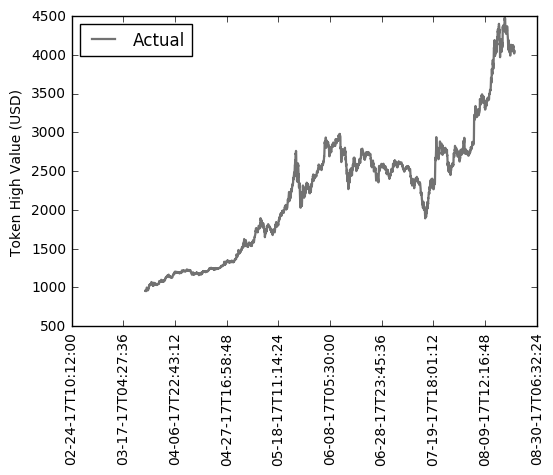
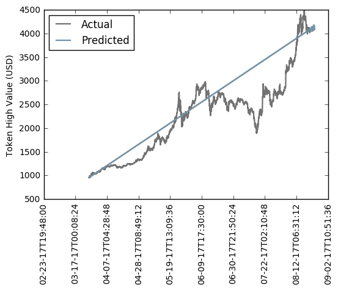

# Price prediction using MLRP and KNeighborsRegressor neural networks

Bitcoin price prediction using custom MLRP and KNeighborsRegressor implementation and data from Cryptomon API (https://api.cryptomon.io/swagger-ui.html).

### What is MLRP?

A multilayer perceptron (MLP) is a feedforward artificial neural network model that maps sets of input data onto a set of appropriate outputs. An MLP consists of multiple layers of nodes in a directed graph, with each layer fully connected to the next one. Except for the input nodes, each node is a neuron (or processing element) with a nonlinear activation function. MLP utilizes a supervised learning technique called backpropagation for training the network.MLP is a modification of the standard linear perceptron and can distinguish data that are not linearly separable. More info on: https://en.wikipedia.org/wiki/Multilayer_perceptron.

### What is KNeighborsRegressor?

The k-nearest neighbors (KNN) algorithm is a non-parametric algorithm that can be used for either classification or regression. Non-parametric means that it makes no assumption about the underlying data or its distribution. It is one of the simplest Machine Learning algorithms, and has applications in a variety of fields, ranging from the healthcare industry, to the finance industry. More info on https://en.wikipedia.org/wiki/K-nearest_neighbors_algorithm.

### API Credentials

To obtain API credentials, follow these instructions:
1. Create new Premium Account: https://cryptomon.io/create-account
2. API credentials under Account information: https://cryptomon.io/account#api


### Run Python code

To run the code below:

1. Click on the cell to select it.
2. Press `SHIFT+ENTER` on your keyboard or press the play button (<button class='fa fa-play icon-play btn btn-xs btn-default'></button>) in the toolbar above.

A full tutorial for using the notebook interface is available [here](ipython_examples/Notebook/Index.ipynb).


```python
%env TZ=UTC

# Cryptomon API credentials
%env API_CLIENT_ID=<API_CLIENT_ID>
%env API_CLIENT_SECRET=<API_CLIENT_SECRET>

%run ./main.py "K_NEIGHBORS_V1" "BITSTAMP" "BTC_USD" "ONE_HOUR" "NOW"


```

    env: TZ=UTC
    env: API_CLIENT_ID=<API_CLIENT_ID>
    env: API_CLIENT_SECRET=<API_CLIENT_SECRET>


    -------------------------------------------------------------------
    Start time = 2017-08-21 09:05:39.705336


    api_client_id: <API_CLIENT_ID>
    api_client_secret: <API_CLIENT_SECRET>
    start: 2017-08-21T09:00:00
    start: 2017-08-21T09:00:00
    end: 2017-08-24T09:00:00
    pred_source: K_NEIGHBORS_V1
    market: BITSTAMP
    currency_pair: BTC_USD
    period: ONE_HOUR


    Requesting access_token...
    Success, access_token: 7c0790b5-f593-2d56-bfa5-82106a0e261b, expires_in: 2836
    Request, url: https://api.cryptomon.io/api/v1/candles, params: {'currencyPair': 'BTC_USD', 'market': 'BITSTAMP', 'period': 'ONE_HOUR'}
    Success, status_code: 200


    Total rows from API: 3555





    C-V:	0.923717151635
    Tst:	0.714617526575
    Trn:	0.844633346885
    C-V:	0.923717151635
    Tst:	0.673598158421
    Trn:	0.954642639719
    C-V:	0.923717151635
    Tst:	0.891176025733
    Trn:	0.884378096433
    period: ONE_HOUR
    sd: 2017-08-21 09:00:00
    ed: 2017-08-24 09:00:00
    ts [  1.50356520e+09   1.50356160e+09   1.50355800e+09   1.50355440e+09
       1.50355080e+09   1.50354720e+09   1.50354360e+09   1.50354000e+09
       1.50353640e+09   1.50353280e+09   1.50352920e+09   1.50352560e+09
       1.50352200e+09   1.50351840e+09   1.50351480e+09   1.50351120e+09
       1.50350760e+09   1.50350400e+09   1.50350040e+09   1.50349680e+09
       1.50349320e+09   1.50348960e+09   1.50348600e+09   1.50348240e+09
       1.50347880e+09   1.50347520e+09   1.50347160e+09   1.50346800e+09
       1.50346440e+09   1.50346080e+09   1.50345720e+09   1.50345360e+09
       1.50345000e+09   1.50344640e+09   1.50344280e+09   1.50343920e+09
       1.50343560e+09   1.50343200e+09   1.50342840e+09   1.50342480e+09
       1.50342120e+09   1.50341760e+09   1.50341400e+09   1.50341040e+09
       1.50340680e+09   1.50340320e+09   1.50339960e+09   1.50339600e+09
       1.50339240e+09   1.50338880e+09   1.50338520e+09   1.50338160e+09
       1.50337800e+09   1.50337440e+09   1.50337080e+09   1.50336720e+09
       1.50336360e+09   1.50336000e+09   1.50335640e+09   1.50335280e+09
       1.50334920e+09   1.50334560e+09   1.50334200e+09   1.50333840e+09
       1.50333480e+09   1.50333120e+09   1.50332760e+09   1.50332400e+09
       1.50332040e+09   1.50331680e+09   1.50331320e+09   1.50330960e+09
       1.50330600e+09]
    self.D.shape[0] 3555
    range(self.npd) range(0, 16)
    P.shape[0]: 73





    End time = 2017-08-21 09:06:05.060412
    -------------------------------------------------------------------


```python
# Let's convert this notebook to a README for the GitHub project's title page:
!jupyter nbconvert --to markdown main.ipynb
!mv main.md README.md
```

    [NbConvertApp] Converting notebook main.ipynb to markdown
    [NbConvertApp] Writing 2405 bytes to main.md
